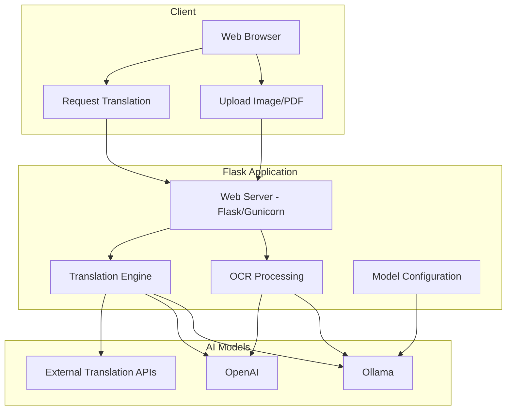

# RAG Translator with OCR

A Flask-based application that combines Retrieval-Augmented Generation (RAG) with Optical Character Recognition (OCR) capabilities. This application allows users to extract text from images or PDF files and translate the content into multiple languages using various translation providers including local AI models via Ollama.

## Features

- **OCR Processing**: Extract text from images (JPG, PNG) and PDF files
- **Multiple Translation Providers**:
  - Ollama (local AI models)
  - OpenAI
  - Google Translate
  - DeepL
  - MyMemory
  - Linguee
  - Pons
- **Configurable AI Settings**: Customize temperature, top-p, and max tokens for AI models
- **Responsive UI**: Modern interface built with Bootstrap
- **Docker Support**: Easy deployment with Docker and Docker Compose

## Architecture



## Requirements

- Python 3.11+
- Tesseract OCR
- Poppler (for PDF processing)
- Ollama (optional, for local AI models)

## Installation

### Using Docker (Recommended)

1. Clone the repository:
   ```bash
   git clone <repository-url>
   cd rag-translator-ocr
   ```

2. Start the application and Ollama service:
   ```bash
   docker-compose up -d
   ```

3. Access the application at: http://localhost:5000

### Manual Installation

1. Clone the repository:
   ```bash
   git clone <repository-url>
   cd rag-translator-ocr
   ```

2. Install dependencies:
   ```bash
   pip install -e .
   ```

3. Install system dependencies:
   - Tesseract OCR
   - Poppler (for PDF processing)

4. Start the application:
   ```bash
   gunicorn --bind 0.0.0.0:5000 --reuse-port --reload main:app
   ```

## Ollama Setup and Configuration

[Ollama](https://ollama.ai) is an open-source, locally run AI model server that allows you to run various large language models on your own hardware.

### Installing Ollama

#### On Linux:
```bash
curl -fsSL https://ollama.ai/install.sh | sh
```

#### On macOS:
Download from [ollama.ai](https://ollama.ai/) or use Homebrew:
```bash
brew install ollama
```

#### On Windows:
Download the installer from [ollama.ai](https://ollama.ai/)

### Running Ollama Locally

1. Start the Ollama service:
   ```bash
   ollama serve
   ```

2. Pull the required models:
   ```bash
   # For OCR
   ollama pull llava

   # For translation
   ollama pull mistral
   ```

### Configuring the Application to Use Ollama

1. In the application, click on the **Settings** button at the bottom of the page.
2. In the **Ollama Settings** tab:
   - Enable "Enable Local Ollama"
   - Set the Ollama Base URL (default: http://localhost:11434)
   - Specify OCR and Translation models (llava and mistral are recommended)
   - Adjust temperature, top-p, and max tokens as needed

## API Keys for External Services

Some translation providers require API keys:

1. **OpenAI**: Obtain from [OpenAI Platform](https://platform.openai.com/)
2. **DeepL**: Obtain from [DeepL API](https://www.deepl.com/pro#developer)

To add API keys:
1. Click the **Settings** button
2. Go to the **API Keys** tab
3. Enter your API keys
4. Click "Save Settings"

## Using the Application

### OCR (Text Extraction from Images)

1. Upload an image or PDF file using the file selector
2. Click "Upload & Process"
3. View the extracted text in the text area
4. Optionally, click "Use for Translation" to send the text to the translation section

### Translation

1. Enter text in the "Text to Translate" field or use extracted text from OCR
2. Select the target language
3. Choose a translation provider
4. Click "Translate"
5. View the translated text in the result area

## Environment Variables

The application can be configured using the following environment variables:

- `OLLAMA_BASE_URL`: URL for Ollama API (default: "http://localhost:11434")
- `OLLAMA_OCR_MODEL`: Model used for OCR processing (default: "llava")
- `OLLAMA_TRANSLATION_MODEL`: Model used for translation (default: "mistral")
- `ENABLE_LOCAL_OLLAMA`: Whether to use local Ollama (default: "false")
- `OLLAMA_TEMPERATURE`: Temperature for AI models (default: "0.3")
- `OLLAMA_TOP_P`: Top-p parameter for AI models (default: "0.9")
- `OLLAMA_MAX_TOKENS`: Maximum tokens for AI model responses (default: "1000")
- `OPENAI_API_KEY`: API key for OpenAI (optional)
- `OPENAI_BASE_URL`: Base URL for OpenAI API (default: "https://api.openai.com/v1")
- `DEEPL_API_KEY`: API key for DeepL (optional)

## Docker Deployment

The included Docker Compose configuration sets up:

1. The web application
2. An Ollama service with GPU support (if available)

You can customize the Docker setup by editing the `docker-compose.yml` file:

```yaml
# Example of modifying docker-compose.yml to use CPU only
services:
  ollama:
    # Remove the deploy section to use CPU only
    # deploy:
    #   resources:
    #     reservations:
    #       devices:
    #         - driver: nvidia
    #           count: all
    #           capabilities: [gpu]
```

## Testing
 ```
 gunicorn --bind 0.0.0.0:5000 --reuse-port --reload main:app
 ```

## Troubleshooting

### OCR Issues

- Ensure Tesseract OCR is properly installed
- Check that the image is clear and legible
- For PDFs, ensure Poppler is installed correctly

### Ollama Connection Issues

- Verify Ollama is running with `ollama list`
- Check the Ollama URL in settings
- Ensure required models are pulled with `ollama pull <model-name>`

### Translation Provider Issues

- Verify API keys are correctly entered in settings
- Some providers have length limitations for free tiers
- Ensure internet connectivity for external providers

## License

This project is licensed under the MIT License - see the LICENSE file for details.