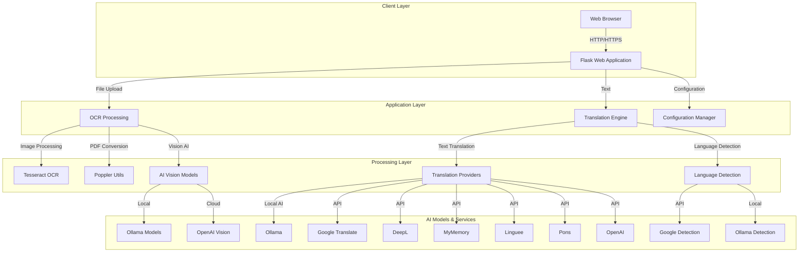
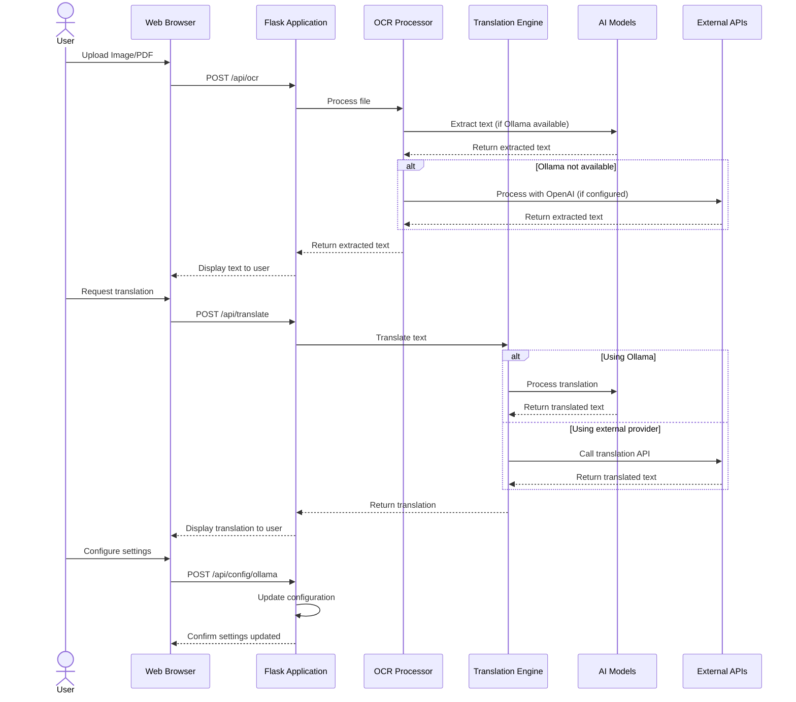
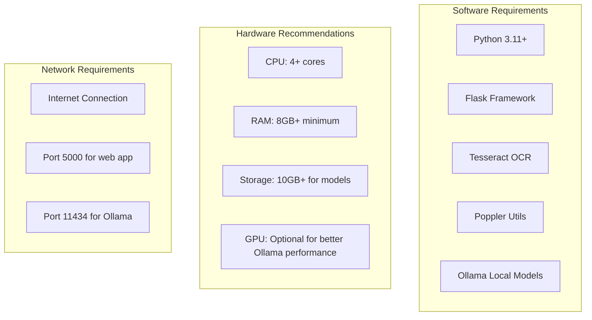
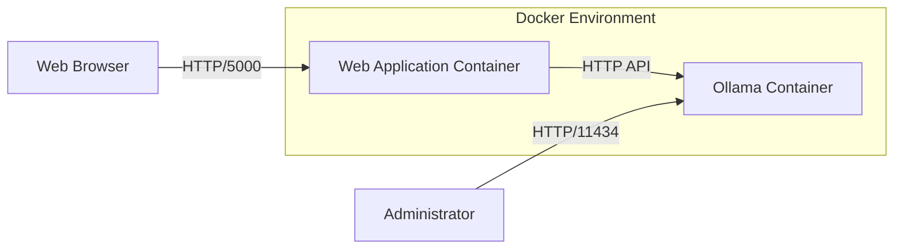

# RAG Translator with OCR - Architecture

This document outlines the detailed architecture of the RAG Translator with OCR application.

## System Components

## Data Flow

## Component Details

### Client Layer
- **Web Browser**: The user interface built with HTML, CSS (Bootstrap), and JavaScript

### Application Layer
- **Flask Web Application**: Core web server handling HTTP requests
- **Gunicorn**: WSGI HTTP server for deployment

### Processing Layer
- **OCR Processing**: Extracts text from images and PDFs
  - Uses Tesseract, Poppler, and AI vision models
- **Translation Engine**: Handles text translation using multiple providers
- **Configuration Manager**: Handles application settings and API keys

### AI Models & External Services
- **Ollama**: Local AI models for OCR and translation
- **OpenAI**: Cloud-based models for OCR and translation (fallback)
- **Translation Providers**: Multiple services for text translation
  - Google Translate, DeepL, MyMemory, Linguee, Pons

## System Requirements

## Deployment Architecture

